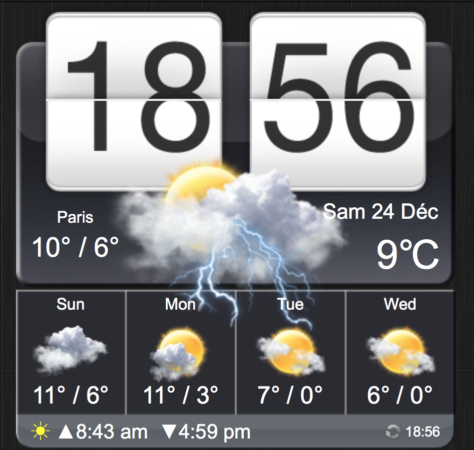

# jdigiclock


## Install
* Require Jquery library 
* Require jQuery AJAX Cross Origin: plugin to bypass Same-origin_policy using Google Apps Script (http://www.ajax-cross-origin.com)
* Copy the project files and insert the code below in an html page located in the same folder
* Change the parameters in the code below to fit your needs
```
<html>
<head>
<meta charset="utf-8">
<script src="https://ajax.googleapis.com/ajax/libs/jquery/3.1.0/jquery.min.js"></script>
<script type="text/javascript" src="jquery.ajax-cross-origin.min.js"></script>
<link rel="stylesheet" type="text/css" href="jquery.jdigiclock.css">
</head>
<body>
<div id="digiclock"></div>
<script type="text/javascript" src="jquery.jdigiclock.js"></script>
<script>
$('#digiclock').jdigiclock({
    imagesPath : 'images/', // Base path to image files. Clock and Weather images are located in subdirectories below this
    am_pm : false, // Specifies the AM/PM option.
    weatherLocationCode : '751090', // Meteofrance city code
    SolarCalendarLocationCode: 'DEPT75', // Meteofrance region code
    weatherUpdate : '60 // Weather update in minutes.
});
</script>

</body>
</html>
```

## Preview



## Changelog

### Version 3.0.0 - 2018-01-05
* Migrated to undocumented MeteoFrance API

### Version 2.1.5 - 2017-01-14
* Fixed API Yahoo

### Version 2.1.4 - 2016-05-31
* Modification by Thomas Cellerier
* Single page view, added French language

### Version 2.1.3 - 2015-03-21
* Unofficial modification by <a href="http://www.baldwhiteguy.co.nz" target="_blank">Andrew Mercer</a>
* Changed to use Yahoo Weather rather than defunct accuweather feed.
* Disabled proxy as redundant with JSONP callback.
* Server offset option allowing JDigiClock to display in specific timezone based on server-supplied time.
* Compatibility with JQuery 1.10.2      

### Version 2.1.0 - 2010-02-24 (https://github.com/dineshkummarc)
* Fixed bug with configuration option <code>weatherImagesPath</code> reported by <a href="http://www.emessage.it" target="_blank">Alessandro Benedetti</a>
* Animation method rewriting
* New configuration option <code>proxyType</code>
* Added .NET proxy. Thanks to <a href="http://www.emessage.it" target="_blank">Alessandro Benedetti</a>

### Version 2.0.0 - 2009-12-06 (https://github.com/dineshkummarc)
* Add 5-day forecast panel.

### Version 1.0.0 - 2009-11-28 (https://github.com/dineshkummarc)
* Initial release.
